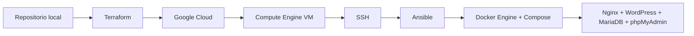
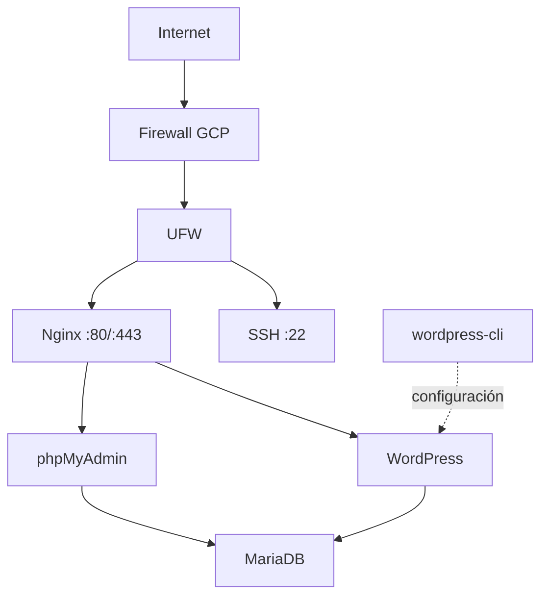
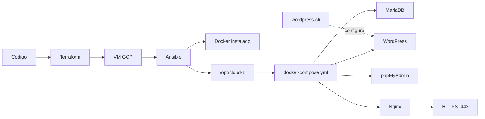

# Cloud-1

Cloud-1 automatiza el camino desde infraestructura en Google Cloud hasta una
aplicación web desplegada en contenedores sobre una VM remota. El despliegue
actual incluye automatización de WordPress, gestión separada de secretos,
hardening del firewall local y reglas de entrada explícitas en GCP.

El proyecto separa responsabilidades en tres capas:

- **Terraform** aprovisiona la infraestructura en Google Cloud.
- **Ansible** configura la VM y prepara el entorno de despliegue.
- **Docker Compose** ejecuta la aplicación formada por Nginx, WordPress,
  MariaDB y phpMyAdmin.



## Vista rápida

| Capa | Responsabilidad | Estado |
|---|---|---|
| Terraform | Aprovisionar VM, red y firewall | Implementado/verificado |
| Ansible | Configurar Ubuntu e instalar Docker | Implementado/verificado |
| Deployment | Automatización completa del despliegue | Implementado; validación fresh pendiente |
| Docker Compose | Definir los servicios de la aplicación | Implementado/verificado |
| Nginx | Reverse proxy y terminación TLS | Implementado/verificado |
| TLS | Certificado autofirmado y HTTPS | Implementado/verificado |
| WordPress | Aplicación web | Implementado/verificado |
| MariaDB | Base de datos persistente | Implementado/verificado |
| phpMyAdmin | Administración web de MariaDB | Implementado/verificado |
| Secretos | `.env` ignorado, copiado y protegido | Implementado/verificado |
| Persistencia | Volúmenes y recuperación tras reinicios | Implementado/verificado |
| Security | Role de hardening y permisos | Implementado/verificado |
| UFW | Firewall local restrictivo | Implementado/verificado |
| Firewall GCP | Prioridades y deny general | Implementado/verificado |
| Idempotencia | Playbook repetido sin cambios | Implementado/verificado |

Terraform aplica **Infrastructure as Code**: la infraestructura se expresa en
archivos versionables, revisables y repetibles. Ansible aplica **Configuration
Management**: declara cómo debe quedar el servidor. Docker Compose describe la
aplicación. Esta separación evita mezclar cloud, sistema operativo y servicios.

---

## Arquitectura actual



La VM expone únicamente los puertos previstos por el proyecto:

- `22/tcp` para SSH.
- `80/tcp` para HTTP, redirigido a HTTPS.
- `443/tcp` para HTTPS.

MariaDB escucha en `3306` **solo dentro de la red Docker**. WordPress y
phpMyAdmin tampoco publican puertos directamente en el host: Nginx es el único
punto de entrada web.

Actualmente TLS usa un certificado autofirmado generado automáticamente por
Ansible. Es suficiente para validar cifrado y configuración HTTPS, aunque un
navegador mostrará una advertencia de confianza al no existir todavía un
certificado firmado por una CA pública.

---

## Flujo de despliegue



El flujo actual es reproducible desde el playbook: Ansible prepara los archivos,
ejecuta `docker compose up -d`, reinicia Nginx si Compose recrea servicios y usa
`wordpress-cli` para comprobar e instalar WordPress cuando todavía no existe.

---

## Estructura actual del repositorio

```text
cloud-1/
├── Makefile
├── .gitignore
├── README.md
├── cloud-1.pdf
├── terraform/
│   ├── providers.tf
│   ├── variables.tf
│   ├── main.tf
│   ├── outputs.tf
│   └── .terraform.lock.hcl
├── ansible/
│   ├── inventory/
│   │   └── hosts.ini
│   ├── playbook.yml
│   └── roles/
│       ├── docker/
│       │   └── tasks/
│       │       └── main.yml
│       ├── deployment/
│       │   └── tasks/
│       │       └── main.yml
│       └── security/
│           └── tasks/
│               └── main.yml
└── docker/
    ├── docker-compose.yml
    └── nginx/
        └── default.conf
```

## Makefile

El `Makefile` proporciona accesos rápidos para operaciones frecuentes:

- `make tf-init`
- `make tf-validate`
- `make tf-plan`
- `make tf-apply`
- `make vm-start`
- `make vm-stop`
- `make vm-status`
- `make ping`
- `make deploy`
- `make ps`
- `make logs`

No es un requisito del subject; se incluye como herramienta de comodidad para
desarrollo y evaluación.

Los certificados TLS **no se guardan en el repositorio**. Ansible los genera
directamente en la VM en:

```text
/opt/cloud-1/certs/
├── cert.pem
└── key.pem
```

---

# Terraform

## `terraform/providers.tf`

Declara el provider `hashicorp/google` con versión `~> 7.0`. El provider usa
las variables `project_id`, `region` y `zone`; separarlo de los recursos
mantiene la configuración de Google Cloud aislada de la infraestructura.

## `terraform/variables.tf`

Centraliza valores reutilizables:

| Variable | Valor por defecto | Uso |
|---|---|---|
| `project_id` | `cloud-1-506415` | Proyecto de Google Cloud |
| `region` | `us-central1` | Región |
| `zone` | `us-central1-c` | Zona |
| `machine_type` | `e2-small` | Tamaño de la VM |

Cada bloque define `description`, `type` y `default`. Usar
`var.machine_type`, por ejemplo, evita repetir valores y facilita cambios.

## `terraform/main.tf`

Define una instancia `google_compute_instance.cloud1_vm` y cuatro recursos de
firewall.

`google_compute_instance.cloud1_vm` es la dirección lógica de Terraform;
`cloud-1-vm` es el nombre real dentro de Google Cloud.

La VM utiliza:

- Ubuntu 22.04 LTS.
- Disco de 10 GB `pd-balanced`.
- Red `default`.
- IP pública efímera.
- Tag `cloud1`.

Las reglas de firewall permiten:

- SSH: `22/tcp`.
- HTTP: `80/tcp`.
- HTTPS: `443/tcp`.

Las tres reglas `cloud1-allow-*` tienen prioridad `900`. La regla
`cloud1-deny-other-ingress` tiene prioridad `1000`, deniega todo el resto del
tráfico entrante y se aplica a las VMs con tag `cloud1`. Como en GCP un número
menor significa mayor prioridad, SSH, HTTP y HTTPS se evalúan antes del deny.
Esto evita que reglas heredadas de la VPC `default`, como `default-allow-rdp`
para `3389`, permitan tráfico no deseado.

La base de datos no necesita una regla pública porque permanece en la red
interna de Docker.

## `terraform/outputs.tf`

El output `public_ip` devuelve la IP pública conocida por Terraform:

```hcl
google_compute_instance.cloud1_vm.network_interface[0].access_config[0].nat_ip
```

La expresión recorre el recurso, la primera interfaz de red, la primera
configuración de acceso y finalmente `nat_ip`.

> La IP es efímera. Después de detener y volver a arrancar la VM puede cambiar,
> por lo que el inventory de Ansible debe actualizarse con la IP actual.

## `.terraform` y `.terraform.lock.hcl`

`terraform init` descarga providers en `.terraform/`; es contenido generado y
se ignora.

`.terraform.lock.hcl` fija versiones y hashes verificados del provider y sí se
versiona.

El state local (`terraform.tfstate`) no debe subirse a Git: puede contener
atributos de infraestructura y datos sensibles. En el clon usado para el
proyecto fue necesario reconstruir el state importando la VM y las reglas que
ya existían antes de aplicar el cambio del firewall.

Al ejecutar `terraform init` desde Linux y Windows pueden aparecer hashes
adicionales válidos para distintas plataformas aunque la versión del provider
sea la misma.

---

# Ansible

## `ansible/inventory/hosts.ini`

Define:

- El grupo lógico `cloud`.
- El alias `cloud1`.
- La IP pública actual.
- El usuario SSH.
- La clave privada usada para la conexión.

La IP puede cambiar al reiniciar la VM.

Además, el usuario SSH puede variar según el equipo desde el que se trabaje.
Por ejemplo, `gcloud compute ssh` puede registrar automáticamente una clave
para el usuario Linux local de una máquina distinta. Por eso conviene validar
primero SSH y después Ansible.

## `ansible/playbook.yml`

El playbook actual:

- Usa `hosts: cloud`.
- Usa `become: true`.
- Ejecuta el role `docker`.
- Ejecuta el role `deployment`.
- Ejecuta el role `security`.

`become: true` eleva privilegios para instalar paquetes, modificar `/etc`,
gestionar servicios y escribir en `/opt`.

## Role `docker`

`ansible/roles/docker/tasks/main.yml` instala Docker de forma declarativa:

| Tarea | Módulo | Objetivo |
|---|---|---|
| Actualizar caché | `apt` | Mantener índices APT actualizados |
| Instalar dependencias | `apt` | Garantizar paquetes necesarios |
| Crear keyring | `file` | Preparar `/etc/apt/keyrings` |
| Descargar clave GPG | `get_url` | Verificar origen del repositorio |
| Añadir repo Docker | `apt_repository` | Configurar repositorio oficial |
| Instalar Docker | `apt` | Instalar Engine, CLI y plugins |
| Iniciar Docker | `service` | Garantizar `started` + `enabled` |

Se instalan:

- `docker-ce`
- `docker-ce-cli`
- `containerd.io`
- `docker-buildx-plugin`
- `docker-compose-plugin`

Verificación registrada durante el desarrollo:

```text
Docker version 29.7.2
Docker Compose version v5.5.0
```

## Role `deployment`

El role `deployment` está implementado. Actualmente:

1. Crea `/opt/cloud-1`.
2. Crea `/opt/cloud-1/data`. Este directorio forma parte de la estructura
   preparada por el role, pero no contiene actualmente los datos persistentes
   de WordPress y MariaDB.
3. Copia `docker-compose.yml`.
4. Copia `nginx/default.conf`.
5. Crea `/opt/cloud-1/certs`.
6. Genera un certificado TLS autofirmado si todavía no existe.
7. Ejecuta `docker compose up -d` desde `/opt/cloud-1`.
8. Reinicia Nginx si Compose creó, recreó o inició servicios.
9. Comprueba con `wp core is-installed` si WordPress ya está instalado.
10. Ejecuta `wp core install` usando las variables del archivo `.env` cuando
    todavía no existe una instalación.
11. Actualiza `home` y `siteurl` con la IP pública actual.

La generación del certificado usa la propiedad `creates`, por lo que no vuelve
a ejecutarse si `cert.pem` ya existe.

Conceptualmente:

```text
Repositorio
   ↓ Ansible
/opt/cloud-1/
├── docker-compose.yml
├── default.conf
├── data/
└── certs/
    ├── cert.pem
    └── key.pem
```

La persistencia actual utiliza los named volumes de Docker `wordpress_data` y
`mariadb_data`, no `/opt/cloud-1/data`.

## Role `security`

El role `security` está implementado. Instala y activa UFW con política
`deny` para conexiones entrantes y `allow` para conexiones salientes. Solo
permite `22/tcp`, `80/tcp` y `443/tcp`. También asegura los permisos de los
archivos sensibles: `.env` y `key.pem` con `0600`, y `cert.pem` con `0644`.

---

# Docker Compose

## Servicios

El `docker-compose.yml` actual define cinco servicios, aunque
`wordpress-cli` usa un perfil auxiliar y no queda ejecutándose como servicio
público permanente.

### MariaDB

Responsabilidad:

- Base de datos de WordPress.
- Persistencia mediante volumen Docker.
- Acceso únicamente desde la red interna.

La base de datos no publica `3306` hacia Internet.

### WordPress

Responsabilidad:

- Aplicación web principal.
- Conexión a `mariadb:3306`.
- Persistencia de `/var/www/html`.

WordPress no publica su puerto `80` directamente en la VM.

### phpMyAdmin

Responsabilidad:

- Interfaz web para administrar MariaDB.
- Se conecta a MariaDB usando su nombre de servicio Docker.

phpMyAdmin tampoco publica directamente su puerto `80`.

### Nginx

Responsabilidad:

- Único punto de entrada web.
- Reverse proxy hacia WordPress y phpMyAdmin.
- Publicación de `80` y `443`.
- Redirección HTTP → HTTPS.
- Terminación TLS.

Routing actual:

```text
https://IP_VM/             → WordPress
https://IP_VM/phpmyadmin/  → phpMyAdmin
```

### wordpress-cli

`wordpress-cli` usa la imagen `wordpress:cli`, comparte el volumen de
WordPress y pertenece al perfil `cli`. Ansible lo ejecuta bajo demanda para
comprobar la instalación, instalar WordPress y actualizar sus URLs. No publica
puertos ni forma parte de la entrada web permanente.

---

# Persistencia

Compose define actualmente:

```text
mariadb_data
wordpress_data
```

`mariadb_data` conserva la información de la base de datos y
`wordpress_data` conserva los archivos de WordPress aunque los contenedores
sean recreados.

Los servicios persistentes `mariadb`, `wordpress`, `phpmyadmin` y `nginx` usan:

```yaml
restart: unless-stopped
```

para volver a arrancar cuando Docker o la VM regresan, salvo que hayan sido
detenidos explícitamente. `wordpress-cli` se ejecuta únicamente bajo demanda
mediante el profile `cli` y no es un servicio permanente.

La persistencia se comprobó tras reiniciar la VM y tras ejecutar
`docker compose down` seguido de `docker compose up`, sin eliminar volúmenes.
`docker compose down -v` sí eliminaría los volúmenes y no se utilizó en esta
prueba.

---

# TLS / HTTPS

El certificado autofirmado se genera automáticamente desde Ansible y no se
versiona.

La clave privada queda con permisos restrictivos en la VM.

Nginx monta:

```text
/opt/cloud-1/certs
        ↓
/etc/nginx/certs
```

y escucha en:

```text
80/tcp  → redirect 301 → HTTPS
443/tcp → TLS + reverse proxy
```

Validación realizada:

```bash
curl -I http://IP_VM
curl -k -I https://IP_VM
curl -k -I https://IP_VM/phpmyadmin/
```

Resultados observados:

```text
HTTP                → 301 hacia HTTPS
HTTPS /             → WordPress operativo
HTTPS /phpmyadmin/  → phpMyAdmin operativo
```

`curl -k` se usa únicamente porque el certificado actual es autofirmado.

---

# Bitácora técnica

## Paso 1 — Diseñar la automatización

**Objetivo.** Reemplazar creación y configuración manual por un proceso
repetible.

**Qué hicimos.** Se separaron Terraform, Ansible y Docker Compose.

```text
Terraform → infraestructura
Ansible   → configuración de la VM
Compose   → aplicación
```

**Concepto aprendido.** Estado deseado: declarar qué debe existir en lugar de
depender de una secuencia manual de clics.

---

## Paso 2 — Autenticar Google Cloud e inicializar Terraform

**Objetivo.** Permitir al provider de Google comunicarse con las APIs.

```bash
gcloud auth login
gcloud config set project cloud-1-506415
gcloud auth application-default login
gcloud auth application-default set-quota-project cloud-1-506415

terraform init
terraform validate
```

**Aprendizaje.**

`gcloud auth login` autentica la CLI.

Application Default Credentials, o ADC, son las credenciales que Terraform
puede descubrir sin almacenarlas en Git.

`terraform validate` valida configuración, pero no crea infraestructura.

---

## Paso 3 — Planificar y aplicar infraestructura

```bash
terraform plan
terraform apply
```

Resultado registrado:

```text
Plan: 4 to add, 0 to change, 0 to destroy
```

**Aprendizaje.**

`plan` compara estado deseado y estado conocido.

`apply` crea o modifica recursos reales.

Terraform State relaciona código y recursos remotos. Puede contener datos
sensibles y no debe subirse al repositorio.

---

## Paso 4 — Resolver SSH entre Windows, WSL y GCP

**Problema.**

Ansible alcanzaba la VM, pero SSH respondía:

```text
Permission denied (publickey)
```

La clave creada por `gcloud` estaba en Windows mientras Ansible se ejecutaba
desde WSL.

**Solución.**

Reutilizar la clave desde WSL y protegerla:

```bash
chmod 600 ~/.ssh/google_compute_engine
```

**Aprendizaje.**

Un fallo `publickey` no significa necesariamente fallo de red: llegar hasta ese
mensaje ya demuestra que el host y el puerto SSH responden.

---

## Paso 5 — Verificar Ansible

```bash
ansible all -i inventory/hosts.ini -m ping
```

Resultado:

```text
cloud1 | SUCCESS => {
    "changed": false,
    "ping": "pong"
}
```

No es ICMP. El módulo `ping` comprueba:

```text
Ansible → SSH → Python remoto → módulo → pong
```

---

## Paso 6 — Instalar Docker declarativamente

Flujo:

```text
APT
 ↓
dependencias
 ↓
/etc/apt/keyrings
 ↓
clave GPG
 ↓
repositorio oficial Docker
 ↓
Docker Engine + Compose
```

La clave GPG permite verificar origen e integridad de los paquetes.

`{{ ansible_distribution_release }}` es un Ansible Fact recopilado del host.
En Ubuntu 22.04 corresponde a `jammy`.

---

## Paso 7 — Comprobar idempotencia

**Objetivo.** Ejecutar varias veces el mismo playbook sin producir cambios
innecesarios.

Resultado observado en segundas ejecuciones:

```text
changed=0
failed=0
```

Los módulos declarativos conocen el estado deseado.

En cambio, un comando ad-hoc ejecutado con `command` o `shell` puede aparecer
como `CHANGED` aunque solo esté consultando información.

---

## Paso 8 — Continuar desde un PC de 42

**Objetivo.** Confirmar que Cloud-1 no depende del PC personal.

Se verificaron:

```text
Terraform ✅
gcloud ✅
Ansible ✅
SSH ✅
```

En el entorno de 42 Ansible estaba instalado con:

```bash
python3 -m pip install --user ansible
```

En una shell donde `~/.local/bin` no estaba en `PATH` fue necesario:

```bash
export PATH="$HOME/.local/bin:$PATH"
```

`gcloud compute ssh` generó una clave SSH para ese entorno y permitió comprobar
qué usuario Linux remoto estaba autorizado.

**Aprendizaje.**

El inventory no debe asumir que el mismo usuario SSH funciona desde todos los
equipos.

---

## Paso 9 — Preparar `/opt/cloud-1`

El role `deployment` creó:

```text
/opt/cloud-1
/opt/cloud-1/data
```

Primera ejecución:

```text
changed=1
```

Segunda ejecución:

```text
changed=0
```

Esto confirmó idempotencia.

---

## Paso 10 — Copiar Docker Compose con Ansible

Se añadió una tarea `copy` para llevar:

```text
docker/docker-compose.yml
```

a:

```text
/opt/cloud-1/docker-compose.yml
```

Primera ejecución: `changed`.

Segunda ejecución: `ok`.

El archivo se validó remotamente con:

```bash
ansible cloud -i inventory/hosts.ini -b -m shell \
  -a "cd /opt/cloud-1 && docker compose config"
```

**Aprendizaje.**

El módulo `command` no interpreta operadores de shell como `cd` o `&&`.
Cuando se necesitan, debe usarse `shell`, o preferiblemente un módulo
declarativo específico cuando exista.

---

## Paso 11 — Levantar MariaDB

Se levantó primero la base de datos para aislar problemas:

```bash
docker compose up -d mariadb
```

Se verificó con:

```bash
docker ps
docker logs --tail 30 cloud1_mariadb
```

Resultado clave:

```text
mariadbd: ready for connections
```

**Aprendizaje.**

MariaDB puede escuchar en `3306` dentro del contenedor sin publicar ese puerto
hacia Internet.

---

## Paso 12 — Añadir WordPress

WordPress se conectó a:

```text
mariadb:3306
```

usando DNS interno de Docker Compose.

Se añadió volumen persistente:

```text
wordpress_data:/var/www/html
```

Los logs confirmaron que WordPress se copió correctamente y Apache quedó
ejecutándose en foreground.

---

## Paso 13 — Añadir phpMyAdmin

phpMyAdmin se configuró para acceder a:

```text
PMA_HOST=mariadb
PMA_PORT=3306
```

Se verificó que el contenedor permanecía `Up` y que Apache/PHP iniciaron sin
errores bloqueantes.

---

## Paso 14 — Añadir Nginx como reverse proxy

Se creó:

```text
docker/nginx/default.conf
```

y Ansible lo copia a:

```text
/opt/cloud-1/default.conf
```

Nginx se añadió a Compose y se conectó a la misma red interna.

Primera prueba HTTP:

```bash
curl -I http://IP_VM
```

WordPress respondió con un redirect al instalador y phpMyAdmin devolvió
`200 OK`.

Esto confirmó que el routing funcionaba.

---

## Paso 15 — Generar TLS automáticamente

Ansible crea:

```text
/opt/cloud-1/certs
```

y ejecuta OpenSSL solo si el certificado todavía no existe.

La tarea usa `creates` para mantener idempotencia.

Primera ejecución:

```text
Generar certificado TLS autofirmado → changed
```

Segunda ejecución:

```text
Generar certificado TLS autofirmado → ok
```

Archivos generados:

```text
cert.pem
key.pem
```

La clave privada tiene permisos más restrictivos que el certificado público.

---

## Paso 16 — Activar HTTPS

Nginx quedó configurado con:

```text
80  → redirect 301
443 → TLS
```

Compose publica:

```text
0.0.0.0:80->80/tcp
0.0.0.0:443->443/tcp
```

Validación final:

```text
HTTP                         → 301 hacia HTTPS
HTTPS /                      → WordPress
HTTPS /phpmyadmin/           → 200 OK
MariaDB                      → solo red interna
```

## Paso 17 — Eliminar secretos hard-coded

**Objetivo.** Evitar que las credenciales aparezcan directamente en
`docker-compose.yml`.

**Solución.** Se sustituyeron las credenciales embebidas por variables de
entorno, se creó `docker/.env` y se añadió `docker/.env` al `.gitignore`.
Ansible copia ese archivo a `/opt/cloud-1/.env` con permisos `0600` y usa
`no_log: true` durante la copia y la instalación de WordPress.

**Aprendizaje.** Un archivo local ignorado por Git evita subir secretos al
repositorio, pero debe protegerse también en la VM y no aparecer en los logs.

## Paso 18 — Rotación de credenciales

**Problema.** Las credenciales temporales utilizadas durante el desarrollo se
consideraron comprometidas al haber formado parte de configuraciones de prueba.

**Solución.** Se rotaron las credenciales de MariaDB sin destruir los
volúmenes persistentes. No se documenta ningún valor real de contraseña en el
README.

**Aprendizaje.** Rotar un secreto no obliga a perder los datos, pero en una
instalación real hay que planificar la actualización coordinada de los
servicios que lo consumen.

## Paso 19 — Automatizar Docker Compose desde Ansible

**Objetivo.** Hacer que el despliegue completo termine levantando los servicios
desde el playbook.

**Solución.** `docker compose up -d` pasó a ejecutarse en el role `deployment`.
También se añadió un reinicio condicional de Nginx cuando Compose crea,
recrea o inicia servicios.

**Problema encontrado.** Después de recrear WordPress apareció un `502 Bad
Gateway`: Nginx conservaba una resolución DNS anterior del contenedor.

**Aprendizaje.** Reiniciar Nginx después de que Compose recree servicios fuerza
la resolución actualizada y elimina ese estado obsoleto.

## Paso 20 — Automatización de WordPress

**Objetivo.** Evitar la instalación manual inicial de WordPress.

**Solución.** Se añadió `wordpress-cli` con el perfil `cli`. Ansible ejecuta
`wp core is-installed`; si no existe una instalación, ejecuta `wp core install`
con las variables del `.env`. Después sincroniza `home` y `siteurl` con la IP
pública actual.

**Problema encontrado.** El primer intento falló porque `wordpress-cli` no tenía
las variables de conexión a MariaDB. Se corrigió añadiendo al servicio las
mismas variables `WORDPRESS_DB_*` que utiliza WordPress.

**Aprendizaje.** Un contenedor auxiliar necesita la configuración de la misma
dependencia que la aplicación que administra, aunque no sea un servicio
público permanente.

## Paso 21 — Prueba de reinicio de la VM

**Objetivo.** Comprobar la recuperación automática de la aplicación.

**Resultado.** Se reinició la instancia. Docker volvió a arrancar y los
contenedores con `restart: unless-stopped` volvieron automáticamente.
WordPress y phpMyAdmin siguieron funcionando.

**Aprendizaje.** La política de reinicio protege frente a reinicios del host,
pero no sustituye las comprobaciones de salud ni la monitorización.

## Paso 22 — Prueba de persistencia

**Objetivo.** Confirmar que los datos sobreviven a la recreación de
contenedores.

**Prueba.** Se ejecutó `docker compose down` y posteriormente `docker compose
up`, sin eliminar volúmenes. `wordpress_data` y `mariadb_data` conservaron los
datos.

`docker compose down -v` sí eliminaría los volúmenes; no se utilizó porque
habría destruido la persistencia que se estaba comprobando.

**Aprendizaje.** La persistencia depende de separar los datos de la vida de
los contenedores y de no usar accidentalmente la opción `-v`.

## Paso 23 — Idempotencia del deployment

**Objetivo.** Ejecutar de nuevo el playbook sin repetir cambios innecesarios.

**Resultado.** Antes de añadir `security`, la segunda ejecución terminó con:

```text
ok=19 changed=0 failed=0
```

**Aprendizaje.** La idempotencia demuestra que Ansible reconoce el estado ya
configurado y no vuelve a modificar directorios, archivos, certificados o
servicios sin necesidad.

## Paso 24 — Implementación del role security

**Objetivo.** Añadir un firewall local y asegurar archivos sensibles.

**Solución.** El role instaló y configuró UFW con `deny incoming` y
`allow outgoing`. Solo se permitieron `22/tcp`, `80/tcp` y `443/tcp`. SSH se
verificó después de activar UFW y siguió funcionando.

**Aprendizaje.** Las reglas deben estar configuradas antes de activar una
política restrictiva para evitar bloquear el acceso de administración.

## Paso 25 — Permisos de archivos sensibles

Se verificaron los permisos finales:

```text
/opt/cloud-1/.env          → 0600
/opt/cloud-1/certs/key.pem → 0600
/opt/cloud-1/certs/cert.pem → 0644
```

La clave privada y el archivo de variables quedan limitados al propietario,
mientras que el certificado público puede ser legible.

## Paso 26 — Verificación de exposición de puertos

`docker ps` confirmó que solo Nginx publica `80` y `443`. WordPress y
phpMyAdmin exponen su puerto `80` únicamente dentro de la red Docker y MariaDB
usa `3306` solo internamente.

Además, `ss -tulpn` confirmó que los puertos TCP públicos relevantes del host
son `22`, `80` y `443`.

**Aprendizaje.** La publicación de puertos debe limitarse al único componente
que necesita recibir tráfico externo: Nginx.

## Paso 27 — Endurecimiento del firewall de GCP

**Problema.** Se detectó una regla heredada `default-allow-rdp` para `3389` en
la VPC `default`.

**Solución.** Las reglas `cloud1-allow-ssh`, `cloud1-allow-http` y
`cloud1-allow-https` recibieron prioridad `900`. Se creó
`cloud1-deny-other-ingress` con prioridad `1000` y `deny all` para las VMs con
tag `cloud1`.

En GCP, un número de prioridad menor se evalúa antes. Por eso las tres reglas
permitidas se aplican antes del deny general, que bloquea el resto del tráfico
entrante y evita que el RDP heredado llegue a la VM.

## Paso 28 — Reconstrucción del Terraform state

**Problema.** En el clon del campus no existía `terraform.tfstate`.
`terraform plan` intentó proponer la creación de recursos que ya existían.

**Solución.** No se ejecutó `apply` en ese estado. Se importaron la VM y las
tres reglas de firewall existentes. Después se aplicó únicamente el cambio
esperado del firewall.

Resultado registrado:

```text
1 added, 4 changed, 0 destroyed
```

Después, `terraform plan` devolvió:

```text
No changes. Your infrastructure matches the configuration.
```

**Aprendizaje.** El state enlaza los recursos reales con la configuración y no
debe subirse a Git porque puede contener información sensible y es específico
del entorno.

## Paso 29 — Idempotencia final

Tras completar `security`, el playbook volvió a ejecutarse y terminó con:

```text
ok=29 changed=0 failed=0
```

SSH siguió funcionando mediante `make ping`, que devolvió `pong`.

**Resultado.** La configuración completa —Docker, deployment, WordPress,
TLS, UFW y permisos— quedó verificada como idempotente.

## Estado actual y validaciones pendientes

La automatización principal está implementada y verificada. Antes de considerar
el proyecto completamente cerrado quedan estas validaciones:

- Despliegue completamente fresco desde cero.
- Instalación automática de WordPress sobre una infraestructura y datos nuevos.
- Revisión del requisito de acceso como root exigido por el subject.
- Despliegue paralelo en varios servidores.

---

# Cómo reproducir lo implementado

## 1. Preparar Terraform

```bash
cd terraform
terraform init
terraform validate
terraform plan
terraform apply
```

## 2. Obtener la IP pública actual

Después de arrancar la VM, comprobar la IP actual con `gcloud` y actualizar el
inventory de Ansible.

Por ejemplo:

```bash
gcloud compute instances list --project cloud-1-506415
```

## 3. Verificar Ansible

```bash
cd ansible
ansible all -i inventory/hosts.ini -m ping
```

## 4. Configurar la VM

```bash
ansible-playbook -i inventory/hosts.ini playbook.yml
```

El playbook:

- Instala/configura Docker.
- Prepara `/opt/cloud-1`.
- Copia Compose.
- Copia Nginx.
- Crea el directorio TLS.
- Genera el certificado si no existe.
- Levanta o actualiza Compose automáticamente.
- Instala WordPress solo si todavía no existe.
- Sincroniza `home` y `siteurl` con la IP actual.
- Configura UFW y asegura permisos de archivos sensibles.

## 5. Validar Compose

```bash
ansible cloud -i inventory/hosts.ini -b -m shell \
  -a "cd /opt/cloud-1 && docker compose config"
```

## 6. Levantar los servicios

Este paso ya forma parte del role `deployment`; se ejecuta automáticamente
durante el playbook mediante `docker compose up -d`. También se reinicia Nginx
si Compose recrea o inicia servicios.

## 7. Verificar contenedores

```bash
ansible cloud -i inventory/hosts.ini -b -a "docker ps"
```

Deben aparecer:

```text
cloud1_nginx
cloud1_phpmyadmin
cloud1_wordpress
cloud1_mariadb
```

## 8. Verificar HTTP/HTTPS

```bash
curl -I http://IP_VM
curl -k -I https://IP_VM
curl -k -I https://IP_VM/phpmyadmin/
```

---

# Seguridad

El `.gitignore` debe excluir al menos:

```text
.terraform/
*.tfstate
*.tfstate.*
*.tfvars
application_default_credentials.json
*.key
*.pem
```

Nunca deben versionarse:

- Claves SSH privadas.
- Credenciales de Google Cloud.
- ADC.
- Tokens.
- Terraform State.
- Claves TLS privadas.
- Contraseñas de base de datos.
- Secretos de WordPress.

## Deuda técnica actual: secretos

Las credenciales no se escriben directamente en `docker-compose.yml`. Se
guardan en `docker/.env`, excluido por `.gitignore`, y Ansible lo copia a
`/opt/cloud-1/.env` con permisos `0600` y `no_log: true`. Las credenciales
temporales usadas durante el desarrollo fueron rotadas y no se incluyen en
este README.

La evolución futura puede migrar este mecanismo a un gestor de secretos, por
ejemplo:

```text
.env no versionado
        o
Ansible Vault / variables protegidas
```

La clave privada TLS queda en `0600`, mientras que el certificado público queda
en `0644`. Además, se verificó que MariaDB no publica `3306` en el host,
WordPress y phpMyAdmin tampoco publican sus puertos directamente y solo Nginx
publica `80` y `443`. `ss -tulpn` confirmó que los puertos TCP públicos
relevantes son `22`, `80` y `443`.

---

# Estado actual

| Elemento | Estado |
|---|---|
| Terraform, provider y variables | IMPLEMENTADO |
| VM y firewall 22/80/443 | IMPLEMENTADO |
| Output de IP pública | IMPLEMENTADO |
| Inventory y conexión SSH | IMPLEMENTADO |
| Role Docker | IMPLEMENTADO |
| Role deployment | IMPLEMENTADO; VALIDACIÓN FRESH PENDIENTE |
| `/opt/cloud-1` y estructura remota | IMPLEMENTADO |
| Docker Compose | IMPLEMENTADO |
| MariaDB | IMPLEMENTADO |
| Volumen MariaDB | IMPLEMENTADO |
| WordPress | IMPLEMENTADO |
| Volumen WordPress | IMPLEMENTADO |
| phpMyAdmin | IMPLEMENTADO |
| `wordpress-cli` e instalación automatizada | IMPLEMENTADO |
| Nginx reverse proxy | IMPLEMENTADO |
| HTTP → HTTPS | IMPLEMENTADO |
| Certificado TLS autofirmado | IMPLEMENTADO |
| Generación idempotente de TLS | IMPLEMENTADO |
| Gestión segura de secretos y rotación | IMPLEMENTADO/VERIFICADO |
| Persistencia tras reinicio y `down` + `up` | IMPLEMENTADO/VERIFICADO |
| Role security y UFW | IMPLEMENTADO/VERIFICADO |
| Firewall GCP con prioridades y deny general | IMPLEMENTADO/VERIFICADO |
| Idempotencia final del playbook | IMPLEMENTADO/VERIFICADO |
| Despliegue completamente fresco desde cero | PENDIENTE DE VALIDACIÓN FINAL |
| Instalación automática sobre datos totalmente nuevos | PENDIENTE DE VALIDACIÓN FINAL |
| Acceso como root exigido por el subject | PENDIENTE DE VALIDACIÓN FINAL |
| Despliegue paralelo en varios servidores | PENDIENTE DE VALIDACIÓN FINAL |
| IP estática | MEJORA FUTURA |
| VPC propia | MEJORA FUTURA |
| Backups | MEJORA FUTURA |
| Monitorización | MEJORA FUTURA |
| CI/CD | MEJORA FUTURA |

---

# Próximos pasos

Orden recomendado:

1. Validar un despliegue completamente fresco desde cero.
2. Validar la instalación automática de WordPress desde datos vacíos.
3. Revisar el requisito de acceso como root exigido por el subject.
4. Probar el despliegue paralelo en varios servidores.
5. Añadir mejoras opcionales: IP estática, VPC propia, backups, monitorización
   y CI/CD.

---

# Conceptos aprendidos

- Infrastructure as Code.
- Desired state.
- Terraform Provider y State.
- ADC para autenticación del provider.
- Compute Engine.
- Firewall y tags de GCP.
- IP pública efímera.
- SSH y claves públicas/privadas.
- Diferencia entre entornos Windows, WSL y Linux de 42.
- Inventory, playbook, roles y Ansible Facts.
- `become`.
- Idempotencia.
- Módulos `apt`, `file`, `get_url`, `apt_repository`, `service`, `copy`,
  `command` y `shell`.
- Docker Engine.
- Docker Compose.
- Redes internas Docker.
- DNS por nombre de servicio.
- Volúmenes persistentes.
- Reverse proxy.
- Nginx.
- HTTP 301.
- TLS/HTTPS.
- Certificados autofirmados.
- Separación entre puertos internos y puertos publicados.
- Prioridades y reglas deny de firewall en GCP.
- UFW y permisos de archivos sensibles.
- Profiles de Compose y automatización con WP-CLI.
- Diagnóstico mediante `docker ps`, logs y `curl`.

---

# Para recordar en evaluación

### ¿Qué hace Terraform?

Crea y mantiene la infraestructura cloud declarada en código.

### ¿Qué hace Ansible?

Configura el sistema operativo remoto y lleva la VM al estado deseado.

### ¿Qué hace Docker Compose?

Define y ejecuta los servicios que forman la aplicación.

### ¿Por qué MariaDB no publica el puerto 3306?

Porque solo WordPress y phpMyAdmin necesitan acceder a ella. Publicarlo
a Internet aumentaría innecesariamente la superficie de ataque.

### ¿Por qué Nginx es el único servicio que publica 80/443?

Porque actúa como punto de entrada y reverse proxy. Los servicios internos
permanecen aislados.

### ¿Qué significa idempotencia?

Que ejecutar repetidamente la automatización deja el sistema en el mismo estado
sin repetir cambios innecesarios.

### ¿Por qué se usa `creates` al generar TLS?

Para que Ansible no regenere el certificado en cada ejecución.

### ¿Por qué `curl -k`?

Porque el certificado actual es autofirmado y no está firmado por una CA que
el sistema confíe por defecto.

### ¿Cuál es una limitación actual importante?

Todavía hay que validar un despliegue completamente fresco, la instalación
automática de WordPress desde datos vacíos, el requisito de acceso como root
del subject y el despliegue paralelo en varios servidores. Las credenciales
temporales ya fueron rotadas y el mecanismo actual usa un `.env` ignorado por
Git, aunque un gestor de secretos sería una mejora futura.

---

# Repositorio

Repositorio público:

https://github.com/Augustojrl92/cloud-1

Rama actual:

```text
master
```
